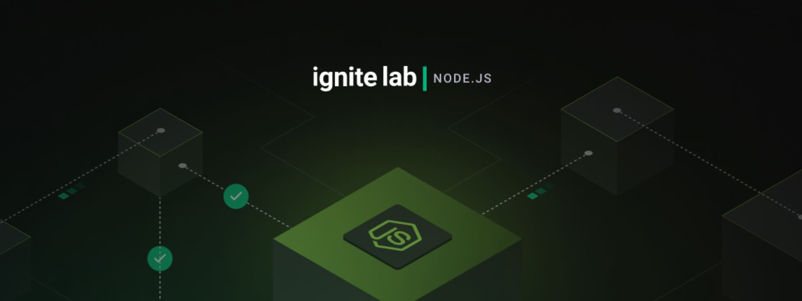

# Rocketseat Ignite Lab: Nodejs

Projeto desenvolvido durante o ignite lab | Node.JS da Rocketseat, que ocorreu entre os dias 12 - 16 de dezembro.

  

---

Feito com 🖤 por [Nicolas Matos](https://github.com/nicolasmatos)
